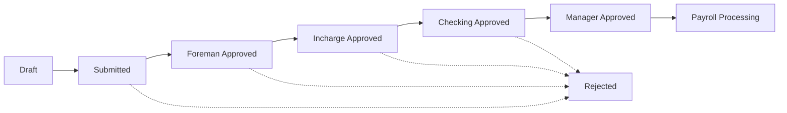

# System Patterns

## System Architecture Overview

The SND Rental React App follows a modular monolithic architecture, combining the best aspects of a modular design with the simplicity of a monolithic deployment. The application is built using Laravel 12 as the backend framework and React with TypeScript for the frontend, connected via Inertia.js.

Key architectural patterns include:

1. **Modular Backend Structure**
   - Using Laravel Modules for separation of concerns
   - Each module contains its own controllers, models, services, etc.
   - Modules communicate through well-defined interfaces

2. **Service-Repository Pattern**
   - Services encapsulate business logic
   - Repositories handle data access and persistence
   - Clear separation between business rules and data operations

3. **Type-Safe Frontend**
   - TypeScript for static typing
   - Defined interfaces and types for API responses
   - Zod for runtime validation

4. **ShadCN UI Component System**
   - Shared UI components for consistency
   - Tailwind CSS for styling
   - Responsive design principles

## Module Organization

The application is organized into a comprehensive modular structure following the Laravel Modules pattern. Each module is designed to be self-contained with its own controllers, models, services, and other components.

```
Modules/
├── Core/                         # Shared infrastructure, authentication, authorization, logging, i18n, settings
│   ├── Config/
│   ├── Database/
│      ├── Migrations/           # users, roles, permissions, activity_logs, settings
│   ├── Events/                   # System-level events
│   ├── Exceptions/               # Custom exceptions
│   ├── Http/
│      ├── Controllers/          # AuthController, ProfileController
│      ├── Middleware/           # Module-specific middleware
│   ├── Providers/                # ModuleServiceProvider
│   ├── Repositories/             # Core data repositories
│   ├── Resources/                # Views and assets
│   ├── Routes/                   # Web and API routes
│   ├── Services/                 # Core services
│   ├── Tests/                    # Module tests
│   └── ViewModels/               # Presentation logic

├── EmployeeManagement/           # HR: employee profiles & organizational data
│   ├── config/
│   ├── database/
│      ├── migrations/           # employees, departments, positions
│   ├── Domain/
│      ├── Models/               # Employee, Department, Position
│   ├── Http/
│      ├── Controllers/          # EmployeeController
│      ├── Requests/             # StoreEmployeeRequest, UpdateEmployeeRequest
│   ├── Observers/                # EmployeeObserver
│   ├── Actions/                  # CreateEmployeeAction
│   ├── Jobs/                     # SendEmployeeWelcomeJob
│   ├── Events/                   # EmployeeCreated
│   ├── Listeners/                # LogEmployeeCreation
│   ├── Queries/                  # GetEmployeesByDeptQuery
│   ├── Repositories/             # EmployeeRepository
│   ├── Services/                 # EmployeeService
│   ├── Providers/                # ModuleServiceProvider
│   ├── routes/                   # Web routes (prefix: hr/employees)
│   ├── resources/                # Views and frontend components
│   └── tests/                    # Unit & Feature tests

├── LeaveManagement/              # HR: leave types & approvals
│   ├── database/
│      ├── migrations/           # leave_types, leaves 
│   ├── Domain/
│      ├── Models/               # LeaveType, Leave
│   ├── Http/
│      ├── Controllers/          # LeaveController
│      ├── Requests/             # StoreLeaveRequest, UpdateLeaveRequest
│   ├── Observers/                # LeaveObserver
│   ├── Actions/                  # RequestLeaveAction
│   ├── Jobs/                     # SendLeaveReminderJob
│   ├── Events/                   # LeaveRequested
│   ├── Listeners/                # NotifyManagerOfLeave
│   ├── Queries/                  # GetPendingLeavesQuery
│   ├── Repositories/             # LeaveRepository
│   ├── Services/                 # LeaveService
│   ├── Providers/                # ModuleServiceProvider
│   ├── routes/                   # Web routes (prefix: hr/leaves)
│   ├── resources/                # Views and frontend components
│   └── tests/                    # Unit & Feature tests

├── TimesheetManagement/          # HR: mobile time-log, geofencing, approvals
│   ├── database/
│      ├── migrations/           # timesheets, attendance_logs
│   ├── Domain/
│      ├── Models/               # Timesheet, AttendanceLog
│   ├── Http/
│      ├── Controllers/          # TimesheetController, AttendanceController
│      ├── Requests/             # StoreTimesheetRequest
│   ├── Observers/                # TimesheetObserver
│   ├── Actions/                  # LogAttendanceAction
│   ├── Jobs/                     # SendGeoFenceAlertJob
│   ├── Events/                   # TimesheetSubmitted
│   ├── Listeners/                # NotifyApproverOfTimesheet
│   ├── Queries/                  # GetApprovedTimesheetsQuery
│   ├── Repositories/             # TimesheetRepository
│   ├── Services/                 # GeoFenceService, TimesheetApprovalService
│   ├── Providers/                # ModuleServiceProvider
│   ├── routes/                   # Web routes (prefix: hr/timesheets)
│   ├── resources/                # Views and frontend components
│   └── tests/                    # Unit & Feature tests

├── Payroll/                      # HR: payroll calc, advances & settlements
│   ├── database/
│      ├── migrations/           # payrolls, salaries, advances, settlements
│   ├── Domain/
│      ├── Models/               # Payroll, Salary, Advance, Settlement
│   ├── Http/
│      ├── Controllers/          # PayrollController, AdvanceSalaryController, SettlementController
│   ├── Observers/                # PayrollObserver
│   ├── Actions/                  # ProcessPayrollAction, ApplyAdvanceAction
│   ├── Jobs/                     # GeneratePayslipsJob
│   ├── Events/                   # PayrollProcessed
│   ├── Listeners/                # NotifyEmployeePayslip
│   ├── Queries/                  # GetUnpaidAdvancesQuery
│   ├── Repositories/             # PayrollRepository
│   ├── Services/                 # PayrollService, SettlementService
│   ├── Providers/                # ModuleServiceProvider
│   ├── routes/                   # Web routes (prefixes: hr/payroll, hr/advances, hr/settlements)
│   ├── resources/                # Views and frontend components
│   └── tests/                    # Unit & Feature tests

├── ProjectManagement/            # PM: projects, tasks, equipment & budgets
│   ├── database/
│      ├── migrations/           # projects, tasks, project_phases, project_equipment
│   ├── Domain/
│      ├── Models/               # Project, Task, ProjectPhase, ProjectEquipment
│   ├── Http/
│      ├── Controllers/          # ProjectController, TaskController, ProjectEquipmentController
│   ├── Observers/                # ProjectObserver
│   ├── Actions/                  # CreateProjectAction, AssignEquipmentAction
│   ├── Jobs/                     # GenerateProjectReportJob
│   ├── Events/                   # ProjectCreated, EquipmentAssigned
│   ├── Listeners/                # LogProjectCreation, LogEquipmentAssignment
│   ├── Queries/                  # GetProjectBudgetQuery
│   ├── Repositories/             # ProjectRepository
│   ├── Services/                 # ProjectDashboardService, BudgetService
│   ├── Providers/                # ModuleServiceProvider
│   ├── routes/                   # Web routes (prefix: projects)
│   ├── resources/                # Views and frontend components
│   └── tests/                    # Unit & Feature tests

├── RentalManagement/             # Rentals: equipment rentals, invoicing, payments
│   ├── database/
│      ├── migrations/           # rental_items, rentals, invoices, payments
│   ├── Domain/
│      ├── Models/               # RentalItem, Rental, RentalInvoice, Payment
│   ├── Http/
│      ├── Controllers/          # RentalController, InvoiceController, EquipmentController
│   ├── Observers/                # RentalObserver
│   ├── Actions/                  # CreateRentalAction, ReturnEquipmentAction
│   ├── Jobs/                     # SendReturnReminderJob
│   ├── Events/                   # RentalCreated
│   ├── Listeners/                # LogRentalActivity
│   ├── Queries/                  # GetOverdueRentalsQuery
│   ├── Repositories/             # RentalRepository
│   ├── Services/                 # RentalService, InvoiceService
│   ├── Providers/                # ModuleServiceProvider
│   ├── routes/                   # Web routes (prefix: rentals)
│   ├── resources/                # Views and frontend components
│   └── tests/                    # Unit & Feature tests

├── EquipmentManagement/          # Standalone: equipment master, maintenance & repair
│   ├── database/
│      ├── migrations/           # equipment, maintenance_records, maintenance_schedules
│   ├── Domain/
│      ├── Models/               # Equipment, MaintenanceRecord, MaintenanceSchedule
│   ├── Http/
│      ├── Controllers/          # EquipmentController, MaintenanceRecordController, MaintenanceScheduleController
│   ├── Observers/                # EquipmentObserver
│   ├── Actions/                  # CreateEquipmentAction, UpdateEquipmentStatusAction, RecordMaintenanceAction
│   ├── Jobs/                     # SendMaintenanceReminderJob, GenerateMaintenanceReportJob
│   ├── Events/                   # EquipmentStatusChanged, MaintenanceScheduled
│   ├── Listeners/                # NotifyMaintenanceTeam, LogEquipmentChange
│   ├── Queries/                  # GetOverdueMaintenanceQuery, GetEquipmentCostSummaryQuery
│   ├── Repositories/             # EquipmentRepository
│   ├── Services/                 # EquipmentService, MaintenanceService
│   ├── Providers/                # ModuleServiceProvider
│   ├── routes/                   # Web routes (prefix: equipment)
│   ├── resources/                # Views and frontend components
│   └── tests/                    # Unit & Feature tests

├── Settings/                     # Company-wide configuration
│   ├── database/
│      ├── migrations/           # settings
│   ├── Domain/
│      ├── Models/               # Setting
│   ├── Http/
│      ├── Controllers/          # SettingController
│      ├── Requests/             # StoreSettingRequest
│   ├── Services/                 # SettingsService
│   ├── Providers/                # ModuleServiceProvider
│   ├── routes/                   # Web routes (prefix: settings)
│   └── resources/                # Views and frontend components

├── Notifications/                # Centralized email/SMS/push
│   ├── database/
│      ├── migrations/           # notifications, channels
│   ├── Domain/
│      ├── Models/               # Notification, Channel
│   ├── Http/
│      ├── Controllers/          # NotificationController
│      ├── Requests/             # SendNotificationRequest
│   ├── Observers/                # NotificationObserver
│   ├── Actions/                  # SendEmailAction, SendSmsAction
│   ├── Jobs/                     # DispatchNotificationJob
│   ├── Events/                   # NotificationCreated
│   ├── Listeners/                # LogNotification
│   ├── Queries/                  # GetUnreadNotificationsQuery
│   ├── Services/                 # NotificationService
│   ├── Providers/                # ModuleServiceProvider
│   ├── routes/                   # Web routes (prefix: notifications)
│   └── resources/                # Views and frontend components

├── Reporting/                    # Cross-module BI & exports
│   ├── database/
│      ├── migrations/           # reports, report_runs
│   ├── Domain/
│      ├── Models/               # ReportDefinition, ReportRun
│   ├── Http/
│      ├── Controllers/          # ReportController
│      ├── Requests/             # RunReportRequest
│   ├── Actions/                  # GenerateReportAction
│   ├── Jobs/                     # ExportReportJob
│   ├── Events/                   # ReportGenerated
│   ├── Listeners/                # NotifyReportReady
│   ├── Queries/                  # GetAvailableReportsQuery
│   ├── Services/                 # ReportingService
│   ├── Providers/                # ModuleServiceProvider
│   ├── routes/                   # Web routes (prefix: reports)
│   └── resources/                # Views and frontend components

├── API/                          # REST/GraphQL for mobile & 3rd-party
│   ├── config/
│   ├── Http/
│      ├── Controllers/          # Api/V1/*
│      ├── Requests/             # Api/V1/*
│   ├── Providers/                # ModuleServiceProvider
│   ├── routes/                   # API routes (prefix: api)
│   └── tests/                    # API tests

├── Localization/                 # Dynamic i18n beyond Spatie
│   ├── database/
│      ├── migrations/           # localization_keys, translations
│   ├── Domain/
│      ├── Models/               # LocalizationKey, Translation
│   ├── Http/
│      ├── Controllers/          # LocalizationController
│      ├── Requests/             # StoreTranslationRequest
│   ├── Services/                 # LocalizationService
│   ├── Providers/                # ModuleServiceProvider
│   ├── routes/                   # Web routes (prefix: localization)
│   └── resources/                # Views and frontend components

├── AuditCompliance/              # GDPR, retention, data-erasure
│   ├── database/
│      ├── migrations/           # audit_logs, data_consents
│   ├── Domain/
│      ├── Models/               # AuditLog, DataConsent
│   ├── Http/
│      ├── Controllers/          # AuditController, ConsentController
│      ├── Requests/             # StoreConsentRequest
│   ├── Observers/                # ModelAuditObserver
│   ├── Jobs/                     # PurgeOldDataJob
│   ├── Events/                   # DataErased
│   ├── Listeners/                # LogDataErasure
│   ├── Queries/                  # GetAuditLogsQuery
│   ├── Services/                 # ComplianceService
│   ├── Providers/                # ModuleServiceProvider
│   ├── routes/                   # Web routes (prefix: audit)
│   └── resources/                # Views and frontend components

└── MobileBridge/                 # PWA & native-bridge support
    ├── Http/
       ├── Controllers/          # PwaManifestController, ServiceWorkerController
    ├── Providers/                # ModuleServiceProvider
    ├── resources/
       ├── public/               # manifest.json, sw.js
       ├── js/pwa/               # Registration scripts
    └── routes/                   # Web routes for serving manifest & SW
```

## Backend Design Patterns

### Action Pattern

For complex business operations, we use single-purpose Action classes that encapsulate a specific use case:

```php
// Example: CreateEmployeeAction.php
class CreateEmployeeAction
{
    private EmployeeRepository $repository;

    public function __construct(EmployeeRepository $repository)
    {
        $this->repository = $repository;
    }

    public function execute(EmployeeDTO $data): Employee
    {
        // Validate, process, and create an employee
        $employee = $this->repository->create($data->toArray());
        
        // Additional business logic
        event(new EmployeeCreated($employee));
        
        return $employee;
    }
}
```

### DTOs (Data Transfer Objects)

DTOs are used to transfer data between layers and enforce type safety:

```php
// Example: EmployeeDTO.php
class EmployeeDTO
{
    public function __construct(
        public readonly string $name,
        public readonly string $email,
        public readonly string $position,
        public readonly ?Carbon $joinDate = null,
        public readonly ?Collection $documents = null
    ) {}
    
    public static function fromRequest(Request $request): self
    {
        return new self(
            name: $request->name,
            email: $request->email,
            position: $request->position,
            joinDate: $request->has('join_date') ? Carbon::parse($request->join_date) : null,
            documents: $request->has('documents') ? collect($request->documents) : null
        );
    }
    
    public function toArray(): array
    {
        return [
            'name' => $this->name,
            'email' => $this->email,
            'position' => $this->position,
            'join_date' => $this->joinDate,
        ];
    }
}
```

### Service Layer

Services encapsulate business logic and orchestrate operations:

```php
// Example: EmployeeService.php
class EmployeeService
{
    private EmployeeRepository $repository;
    private DocumentService $documentService;
    
    public function __construct(EmployeeRepository $repository, DocumentService $documentService)
    {
        $this->repository = $repository;
        $this->documentService = $documentService;
    }
    
    public function createEmployee(EmployeeDTO $data): Employee
    {
        $employee = $this->repository->create($data->toArray());
        
        if ($data->documents) {
            foreach ($data->documents as $document) {
                $this->documentService->attachToEmployee($employee, $document);
            }
        }
        
        return $employee;
    }
    
    // Other methods...
}
```

### Repository Pattern

Repositories abstract database operations and provide a clean interface for data access:

```php
// Example: EmployeeRepository.php
class EmployeeRepository
{
    public function find(int $id): ?Employee
    {
        return Employee::find($id);
    }
    
    public function create(array $data): Employee
    {
        return Employee::create($data);
    }
    
    public function update(Employee $employee, array $data): Employee
    {
        $employee->update($data);
        return $employee;
    }
    
    public function delete(Employee $employee): bool
    {
        return $employee->delete();
    }
    
    public function findWithDocuments(int $id): ?Employee
    {
        return Employee::with('documents')->find($id);
    }
}
```

### Model Observers

For side effects on model events:

```php
// Example: EmployeeObserver.php
class EmployeeObserver
{
    public function created(Employee $employee): void
    {
        // Create default permissions
    }
    
    public function updating(Employee $employee): void
    {
        // Validate updates
    }
    
    public function deleted(Employee $employee): void
    {
        // Perform cleanup
    }
}
```

## Frontend Design Patterns

### Component Structure

React components are organized by feature and follow a consistent structure:

```
components/
├── shared/             # Shared components used across features
│   ├── Button/
│   ├── Card/
│   ├── Input/
│   └── ...
├── layout/             # Layout components
│   ├── AdminLayout/
│   ├── AuthLayout/
│   └── ...
├── employee/           # Feature-specific components
│   ├── EmployeeForm/
│   ├── EmployeeList/
│   └── ...
└── ...
```

### Typed API Client

A typed API client ensures type safety when communicating with the backend:

```typescript
// Example: employeeApi.ts
import { ApiResponse } from '@/types/api';
import { Employee, EmployeeCreateInput } from '@/types/employee';
import axios from 'axios';

export const employeeApi = {
  getAll: async (): Promise<ApiResponse<Employee[]>> => {
    const response = await axios.get('/api/employees');
    return response.data;
  },
  
  getById: async (id: number): Promise<ApiResponse<Employee>> => {
    const response = await axios.get(`/api/employees/${id}`);
    return response.data;
  },
  
  create: async (data: EmployeeCreateInput): Promise<ApiResponse<Employee>> => {
    const response = await axios.post('/api/employees', data);
    return response.data;
  },
  
  update: async (id: number, data: Partial<EmployeeCreateInput>): Promise<ApiResponse<Employee>> => {
    const response = await axios.put(`/api/employees/${id}`, data);
    return response.data;
  },
  
  delete: async (id: number): Promise<ApiResponse<void>> => {
    const response = await axios.delete(`/api/employees/${id}`);
    return response.data;
  }
};
```

### Form Handling with React Hook Form and Zod

Forms are managed using React Hook Form with Zod for validation:

```typescript
// Example: employeeSchema.ts
import { z } from 'zod';

export const employeeSchema = z.object({
  name: z.string().min(2, { message: "Name must be at least 2 characters" }),
  email: z.string().email({ message: "Invalid email address" }),
  position: z.string().min(2, { message: "Position is required" }),
  join_date: z.string().optional(),
  department_id: z.number().optional(),
});

export type EmployeeFormValues = z.infer<typeof employeeSchema>;

// Example usage in a component
import { useForm } from 'react-hook-form';
import { zodResolver } from '@hookform/resolvers/zod';
import { employeeSchema, EmployeeFormValues } from './employeeSchema';

const EmployeeForm = () => {
  const form = useForm<EmployeeFormValues>({
    resolver: zodResolver(employeeSchema),
    defaultValues: {
      name: '',
      email: '',
      position: '',
    },
  });
  
  const onSubmit = (data: EmployeeFormValues) => {
    // Submit data
  };
  
  return (
    <form onSubmit={form.handleSubmit(onSubmit)}>
      {/* Form fields */}
    </form>
  );
};
```

## HR & Payroll Specific Patterns

### Timesheet Management

The timesheet system uses a flexible tracking mechanism that integrates with projects:

```php
// Example: TimesheetEntry model
class TimesheetEntry extends Model
{
    protected $fillable = [
        'employee_id',
        'project_id',
        'date',
        'hours',
        'description',
        'status',
        'is_overtime',
    ];
    
    protected $casts = [
        'date' => 'date',
        'hours' => 'float',
        'is_overtime' => 'boolean',
    ];
    
    public function employee()
    {
        return $this->belongsTo(Employee::class);
    }
    
    public function project()
    {
        return $this->belongsTo(Project::class);
    }
    
    public function approver()
    {
        return $this->belongsTo(User::class, 'approved_by');
    }
    
    // Scopes
    public function scopeForPayrollPeriod($query, $startDate, $endDate)
    {
        return $query->whereBetween('date', [$startDate, $endDate])
                    ->where('status', 'approved');
    }
    
    public function scopeForEmployee($query, $employeeId)
    {
        return $query->where('employee_id', $employeeId);
    }
}
```

#### 4-Step Timesheet Approval Workflow

The timesheet approval process follows a structured 4-step workflow:



This workflow is implemented using a state machine pattern in the Timesheet model:

```php
class Timesheet extends Model
{
    // Status constants
    const STATUS_DRAFT = 'draft';
    const STATUS_SUBMITTED = 'submitted';
    const STATUS_FOREMAN_APPROVED = 'foreman_approved';
    const STATUS_INCHARGE_APPROVED = 'incharge_approved';
    const STATUS_CHECKING_APPROVED = 'checking_approved';
    const STATUS_MANAGER_APPROVED = 'manager_approved';
    const STATUS_REJECTED = 'rejected';
    
    // Status transition methods
    public function submit(): bool
    {
        if ($this->status !== self::STATUS_DRAFT) {
            return false;
        }
        
        return $this->update(['status' => self::STATUS_SUBMITTED]);
    }
    
    public function approveByForeman(int $approverId, ?string $notes = null): bool
    {
        if ($this->status !== self::STATUS_SUBMITTED) {
            return false;
        }
        
        return $this->update([
            'status' => self::STATUS_FOREMAN_APPROVED,
            'foreman_approval_by' => $approverId,
            'foreman_approval_at' => now(),
            'foreman_approval_notes' => $notes,
        ]);
    }
    
    // Additional approval methods for other stages...
}
```

The approval workflow is managed by a dedicated service class:

```php
class TimesheetApprovalService
{
    public function approveByForeman(int $timesheetId, TimesheetApprovalDTO $data): Timesheet
    {
        // Transaction handling, error logging, etc.
        $timesheet = $this->timesheetRepository->findById($timesheetId);
        $approved = $timesheet->approveByForeman($data->approverId, $data->notes);
        
        if ($approved) {
            // Send notifications, log activity, etc.
            $this->notifyNextApprover($timesheet);
        }
        
        return $timesheet;
    }
    
    // Additional methods for other approval stages...
}
```

This pattern ensures:
- Clear separation of concerns
- Proper validation of state transitions
- Audit trail of all approval steps
- Notification system for each stage
- Role-based access control

### Salary Calculation Service

The salary calculation system handles various scenarios including overtime and prorated calculations:

```php
// Example: SalaryCalculationService
class SalaryCalculationService
{
    public function calculateSalary(Employee $employee, Carbon $startDate, Carbon $endDate): SalaryDTO
    {
        // Get base salary
        $baseSalary = $employee->baseSalary;
        
        // Get working days in period
        $workingDaysInPeriod = $this->getWorkingDays($startDate, $endDate);
        $totalWorkingDaysInMonth = $this->getTotalWorkingDaysInMonth($startDate);
        
        // Get timesheet entries
        $timesheetEntries = TimesheetEntry::forEmployee($employee->id)
                                           ->forPayrollPeriod($startDate, $endDate)
                                           ->get();
        
        // Calculate regular hours
        $regularHours = $timesheetEntries->where('is_overtime', false)->sum('hours');
        
        // Calculate overtime hours
        $overtimeHours = $timesheetEntries->where('is_overtime', true)->sum('hours');
        
        // Calculate prorated salary (if not full month)
        $proratedFactor = $workingDaysInPeriod / $totalWorkingDaysInMonth;
        $proratedSalary = $baseSalary * $proratedFactor;
        
        // Calculate overtime pay
        $hourlyRate = $baseSalary / ($totalWorkingDaysInMonth * 8); // Assuming 8 hour workday
        $overtimePay = $overtimeHours * $hourlyRate * 1.5; // 1.5x for overtime
        
        // Calculate deductions
        $deductions = $this->calculateDeductions($employee, $proratedSalary);
        
        // Calculate advance salary deductions
        $advanceDeductions = $this->calculateAdvanceDeductions($employee, $startDate, $endDate);
        
        // Calculate total salary
        $netSalary = $proratedSalary + $overtimePay - $deductions - $advanceDeductions;
        
        return new SalaryDTO(
            employeeId: $employee->id,
            periodStart: $startDate,
            periodEnd: $endDate,
            baseSalary: $baseSalary,
            proratedSalary: $proratedSalary,
            regularHours: $regularHours,
            overtimeHours: $overtimeHours,
            overtimePay: $overtimePay,
            deductions: $deductions,
            advanceDeductions: $advanceDeductions,
            netSalary: $netSalary
        );
    }
    
    // Other helper methods...
}
```

### Advance Salary Management

Advance salary requests follow a workflow pattern:

```php
// Example: AdvanceSalaryRequest model
class AdvanceSalaryRequest extends Model
{
    protected $fillable = [
        'employee_id',
        'amount',
        'request_date',
        'reason',
        'status',
        'approved_by',
        'approval_date',
        'payment_date',
        'repayment_month',
    ];
    
    protected $casts = [
        'request_date' => 'date',
        'approval_date' => 'date',
        'payment_date' => 'date',
        'amount' => 'decimal:2',
    ];
    
    public function employee()
    {
        return $this->belongsTo(Employee::class);
    }
    
    public function approver()
    {
        return $this->belongsTo(User::class, 'approved_by');
    }
    
    // Status workflow methods
    public function approve(User $approver)
    {
        $this->update([
            'status' => 'approved',
            'approved_by' => $approver->id,
            'approval_date' => now(),
        ]);
        
        event(new AdvanceSalaryApproved($this));
    }
    
    public function reject(User $approver, string $reason)
    {
        $this->update([
            'status' => 'rejected',
            'approved_by' => $approver->id,
            'approval_date' => now(),
            'notes' => $reason,
        ]);
        
        event(new AdvanceSalaryRejected($this));
    }
    
    public function markAsPaid()
    {
        $this->update([
            'status' => 'paid',
            'payment_date' => now(),
        ]);
        
        event(new AdvanceSalaryPaid($this));
    }
}
```

### Final Settlement Calculation

For employee departures, a comprehensive settlement calculation is used:

```php
// Example: FinalSettlementService
class FinalSettlementService
{
    private PayrollService $payrollService;
    private LeaveService $leaveService;
    
    public function __construct(PayrollService $payrollService, LeaveService $leaveService)
    {
        $this->payrollService = $payrollService;
        $this->leaveService = $leaveService;
    }
    
    public function calculateSettlement(Employee $employee, Carbon $terminationDate): SettlementDTO
    {
        // Get last day of current month
        $lastDayOfMonth = $terminationDate->copy()->endOfMonth();
        
        // Calculate salary for current month (prorated)
        $currentMonthSalary = $this->payrollService->calculateProratedSalary(
            $employee,
            $terminationDate->copy()->startOfMonth(),
            $terminationDate
        );
        
        // Calculate pending overtime
        $pendingOvertime = $this->payrollService->calculatePendingOvertimePay($employee, $terminationDate);
        
        // Calculate unused leave encashment
        $unusedLeaveEncashment = $this->leaveService->calculateUnusedLeaveEncashment($employee, $terminationDate);
        
        // Calculate gratuity (if applicable)
        $gratuity = $this->calculateGratuity($employee, $terminationDate);
        
        // Calculate pending reimbursements
        $pendingReimbursements = $this->calculatePendingReimbursements($employee);
        
        // Calculate deductions
        $deductions = $this->calculateOutstandingDeductions($employee);
        
        // Calculate outstanding advance salary
        $outstandingAdvance = $this->payrollService->calculateOutstandingAdvanceSalary($employee);
        
        // Calculate total settlement amount
        $totalSettlement = 
            $currentMonthSalary +
            $pendingOvertime +
            $unusedLeaveEncashment +
            $gratuity +
            $pendingReimbursements -
            $deductions -
            $outstandingAdvance;
        
        return new SettlementDTO(
            employeeId: $employee->id,
            terminationDate: $terminationDate,
            currentMonthSalary: $currentMonthSalary,
            pendingOvertime: $pendingOvertime,
            unusedLeaveEncashment: $unusedLeaveEncashment,
            gratuity: $gratuity,
            pendingReimbursements: $pendingReimbursements,
            deductions: $deductions,
            outstandingAdvance: $outstandingAdvance,
            totalSettlement: $totalSettlement
        );
    }
    
    // Helper methods...
}
```

### Equipment Rental Workflow

For employee equipment assignments, a tracking system is used:

```php
// Example: EmployeeEquipmentAssignment model
class EmployeeEquipmentAssignment extends Model
{
    protected $fillable = [
        'employee_id',
        'equipment_id',
        'assigned_date',
        'expected_return_date',
        'returned_date',
        'status',
        'condition_on_assignment',
        'condition_on_return',
        'notes',
        'assigned_by',
    ];
    
    protected $casts = [
        'assigned_date' => 'date',
        'expected_return_date' => 'date',
        'returned_date' => 'date',
    ];
    
    public function employee()
    {
        return $this->belongsTo(Employee::class);
    }
    
    public function equipment()
    {
        return $this->belongsTo(Equipment::class);
    }
    
    public function assignedBy()
    {
        return $this->belongsTo(User::class, 'assigned_by');
    }
    
    // Workflow methods
    public function markAsReturned($condition, $notes = null)
    {
        $this->update([
            'returned_date' => now(),
            'status' => 'returned',
            'condition_on_return' => $condition,
            'notes' => $notes,
        ]);
        
        // Update equipment status
        $this->equipment->update(['status' => 'available']);
        
        event(new EquipmentReturned($this));
    }
    
    public function extendAssignment(Carbon $newReturnDate)
    {
        $this->update([
            'expected_return_date' => $newReturnDate,
        ]);
        
        event(new EquipmentAssignmentExtended($this));
    }
    
    // Reminder scheduling
    public function scheduleReminders()
    {
        // Schedule reminder for 3 days before expected return
        $reminderDate = $this->expected_return_date->copy()->subDays(3);
        
        if ($reminderDate->isFuture()) {
            SendEquipmentReturnReminderJob::dispatch($this)
                ->delay($reminderDate);
        }
    }
}
```

### Project Management Integration

Projects are integrated with timesheets and resource allocation:

```php
// Example: Project model
class Project extends Model
{
    protected $fillable = [
        'name',
        'description',
        'start_date',
        'end_date',
        'status',
        'budget',
        'client_id',
        'manager_id',
    ];
    
    protected $casts = [
        'start_date' => 'date',
        'end_date' => 'date',
        'budget' => 'decimal:2',
    ];
    
    public function manager()
    {
        return $this->belongsTo(User::class, 'manager_id');
    }
    
    public function client()
    {
        return $this->belongsTo(Client::class);
    }
    
    public function employees()
    {
        return $this->belongsToMany(Employee::class, 'project_employees')
                   ->withPivot('role', 'allocation_percentage', 'start_date', 'end_date')
                   ->withTimestamps();
    }
    
    public function timesheetEntries()
    {
        return $this->hasMany(TimesheetEntry::class);
    }
    
    public function dailyLogs()
    {
        return $this->hasMany(ProjectDailyLog::class);
    }
    
    public function phases()
    {
        return $this->hasMany(ProjectPhase::class);
    }
    
    // Status methods
    public function getCurrentPhase()
    {
        return $this->phases()
                   ->where('start_date', '<=', now())
                   ->where('end_date', '>=', now())
                   ->first();
    }
    
    // Budget methods
    public function getTotalHoursLogged()
    {
        return $this->timesheetEntries()->sum('hours');
    }
    
    public function getBudgetUtilization()
    {
        $totalExpenses = $this->expenses()->sum('amount');
        return ($totalExpenses / $this->budget) * 100;
    }
}

// Example: ProjectPhase model for tracking project stages
class ProjectPhase extends Model
{
    protected $fillable = [
        'project_id',
        'name',
        'description',
        'start_date',
        'end_date',
        'status',
        'deliverables',
    ];
    
    protected $casts = [
        'start_date' => 'date',
        'end_date' => 'date',
        'deliverables' => 'array',
    ];
    
    public function project()
    {
        return $this->belongsTo(Project::class);
    }
    
    public function tasks()
    {
        return $this->hasMany(ProjectTask::class);
    }
    
    // Phase type methods
    public function isPlanning()
    {
        return $this->name === 'Planning';
    }
    
    public function isExecution()
    {
        return $this->name === 'Execution';
    }
    
    public function isClosure()
    {
        return $this->name === 'Closure';
    }
}
```

### Multi-language Support

The system supports both English and Arabic through Spatie Translatable:

```php
// Example: Using Spatie Translatable in models
use Spatie\Translatable\HasTranslations;

class Department extends Model
{
    use HasTranslations;
    
    protected $fillable = ['name', 'description'];
    
    public $translatable = ['name', 'description'];
}

// Usage example
$department = new Department();
$department->setTranslation('name', 'en', 'Human Resources');
$department->setTranslation('name', 'ar', 'الموارد البشرية');
$department->save();

// Retrieving based on application locale
$departmentName = $department->name; // Returns based on current locale
```

### Language Switching Component

Frontend component for switching languages:

```tsx
// Example: LanguageSwitcher.tsx
import { useState } from 'react';
import { usePage } from '@inertiajs/react';
import { router } from '@inertiajs/react';
import { Button } from '@/components/ui/button';
import { useTranslation } from '@/hooks/useTranslation';

export const LanguageSwitcher = () => {
  const { locale } = usePage().props;
  const { t } = useTranslation();
  const [isChanging, setIsChanging] = useState(false);
  
  const switchLocale = () => {
    setIsChanging(true);
    const newLocale = locale === 'en' ? 'ar' : 'en';
    
    router.post(route('locale.update'), {
      locale: newLocale
    }, {
      preserveState: true,
      onSuccess: () => {
        document.documentElement.dir = newLocale === 'ar' ? 'rtl' : 'ltr';
        document.documentElement.lang = newLocale;
        setIsChanging(false);
      }
    });
  };
  
  return (
    <Button 
      variant="ghost" 
      onClick={switchLocale}
      disabled={isChanging}
      className="flex items-center gap-2"
    >
      {locale === 'en' ? 'العربية' : 'English'}
      {isChanging ? (
        <span className="animate-spin">⟳</span>
      ) : (
        <span>{locale === 'en' ? '🇸🇦' : '🇺🇸'}</span>
      )}
    </Button>
  );
};
```

## Design Patterns for Better Maintainability

### Facade Pattern

For simplifying complex subsystems:

```php
// Example: PayrollFacade.php
class PayrollFacade
{
    private SalaryCalculationService $salaryService;
    private TimesheetService $timesheetService;
    private AdvanceSalaryService $advanceService;
    private TaxService $taxService;
    
    public function __construct(
        SalaryCalculationService $salaryService,
        TimesheetService $timesheetService,
        AdvanceSalaryService $advanceService,
        TaxService $taxService
    ) {
        $this->salaryService = $salaryService;
        $this->timesheetService = $timesheetService;
        $this->advanceService = $advanceService;
        $this->taxService = $taxService;
    }
    
    public function processMonthlyPayroll(Carbon $startDate, Carbon $endDate): PayrollResultDTO
    {
        // Get all active employees
        $employees = Employee::where('status', 'active')->get();
        
        $results = collect();
        
        foreach ($employees as $employee) {
            // Get timesheet data
            $timesheetData = $this->timesheetService->getApprovedTimesheets($employee, $startDate, $endDate);
            
            // Calculate salary
            $salary = $this->salaryService->calculateSalary($employee, $startDate, $endDate);
            
            // Process advance salary deductions
            $advanceDeductions = $this->advanceService->processDeductions($employee, $startDate);
            
            // Calculate taxes
            $taxes = $this->taxService->calculateTaxes($employee, $salary->netSalary);
            
            // Create final payslip
            $payslip = new PayslipDTO(
                employee: $employee,
                period: [$startDate, $endDate],
                salary: $salary->netSalary,
                deductions: $advanceDeductions + $taxes,
                netAmount: $salary->netSalary - $advanceDeductions - $taxes
            );
            
            $results->push($payslip);
        }
        
        return new PayrollResultDTO(
            startDate: $startDate,
            endDate: $endDate,
            totalEmployees: $employees->count(),
            totalAmount: $results->sum('netAmount'),
            payslips: $results
        );
    }
}
```

### Strategy Pattern

For handling different calculation strategies:

```php
// Example: SalaryCalculationStrategy interface
interface SalaryCalculationStrategy
{
    public function calculate(Employee $employee, Carbon $startDate, Carbon $endDate): float;
}

// Example: Regular salary calculation
class RegularSalaryStrategy implements SalaryCalculationStrategy
{
    public function calculate(Employee $employee, Carbon $startDate, Carbon $endDate): float
    {
        // Calculate regular salary
        return $employee->base_salary;
    }
}

// Example: Prorated salary calculation
class ProratedSalaryStrategy implements SalaryCalculationStrategy
{
    public function calculate(Employee $employee, Carbon $startDate, Carbon $endDate): float
    {
        $daysInMonth = $endDate->daysInMonth;
        $workedDays = $endDate->diffInDays($startDate) + 1;
        
        return ($employee->base_salary / $daysInMonth) * $workedDays;
    }
}

// Example: Context class
class SalaryCalculator
{
    private SalaryCalculationStrategy $strategy;
    
    public function setStrategy(SalaryCalculationStrategy $strategy): void
    {
        $this->strategy = $strategy;
    }
    
    public function calculateSalary(Employee $employee, Carbon $startDate, Carbon $endDate): float
    {
        return $this->strategy->calculate($employee, $startDate, $endDate);
    }
}

// Usage
$calculator = new SalaryCalculator();

// For full month
$calculator->setStrategy(new RegularSalaryStrategy());
$fullMonthSalary = $calculator->calculateSalary($employee, $startDate, $endDate);

// For partial month
$calculator->setStrategy(new ProratedSalaryStrategy());
$proratedSalary = $calculator->calculateSalary($employee, $startDate, $endDate);
```

### Observer Pattern

For reacting to system events:

```php
// Example: PayrollProcessedEvent.php
class PayrollProcessedEvent
{
    public function __construct(
        public readonly Carbon $processDate,
        public readonly int $employeeCount,
        public readonly float $totalAmount
    ) {}
}

// Example: Listeners
class SendPayrollNotifications
{
    public function handle(PayrollProcessedEvent $event): void
    {
        // Notify HR and finance departments
    }
}

class GeneratePayrollReports
{
    public function handle(PayrollProcessedEvent $event): void
    {
        // Generate and store reports
    }
}

class UpdateAccountingSystem
{
    public function handle(PayrollProcessedEvent $event): void
    {
        // Integrate with accounting software
    }
}
```

## Technical Implementation Guidelines

### Type Safety

Throughout the application, we prioritize type safety:

1. **PHP**:
   - Strong type hints for method parameters and return types
   - DTOs for data transfer between layers
   - Strict property types for models
   - Validation using Form Requests

2. **TypeScript**:
   - Interfaces for API responses
   - Type definitions for component props
   - Zod schemas for runtime validation
   - Utility types for derived types

### Documentation

All code should be well-documented:

1. **PHP**:
   - PHPDoc blocks for classes and methods
   - Clear parameter and return type documentation
   - Usage examples for complex classes

2. **TypeScript**:
   - JSDoc comments for functions and components
   - Type definitions with descriptions
   - Props documentation with examples

### Testing

Testing is a core part of the development process:

1. **Unit Tests**:
   - Test each service and repository
   - Mock external dependencies
   - Focus on business logic

2. **Feature Tests**:
   - Test API endpoints
   - Test form submissions
   - Verify authentication and authorization

3. **Frontend Tests**:
   - Test component rendering
   - Test user interactions
   - Test form validation

## Application Layer Interactions

The interactions between layers follow a consistent pattern:

1. **Controller**:
   - Receives request
   - Validates input
   - Calls appropriate service
   - Returns response

2. **Service**:
   - Contains business logic
   - Coordinates between repositories
   - Handles events and notifications
   - Returns DTOs

3. **Repository**:
   - Performs data access operations
   - Handles database queries
   - Returns model instances

4. **Model**:
   - Defines relationships
   - Contains accessors and mutators
   - Handles data casting
   - Defines scopes for queries

This consistent pattern ensures that each layer has a single responsibility and makes the codebase more maintainable.

## Summary of Key Design Decisions

1. **Modular Architecture**: Separate modules for different business domains.
2. **Service-Repository Pattern**: Clear separation of business logic and data access.
3. **Type Safety**: Strong typing throughout the application.
4. **Action Classes**: Single-purpose classes for complex business operations.
5. **DTOs**: For safe data transfer between layers.
6. **Event-Driven**: Using events and observers for side effects.
7. **Strategy Pattern**: For varying algorithms based on context.
8. **Facade Pattern**: For simplifying complex subsystems.
9. **Observer Pattern**: For reacting to system events.
10. **Multi-language Support**: Using Spatie Translatable for language handling.
